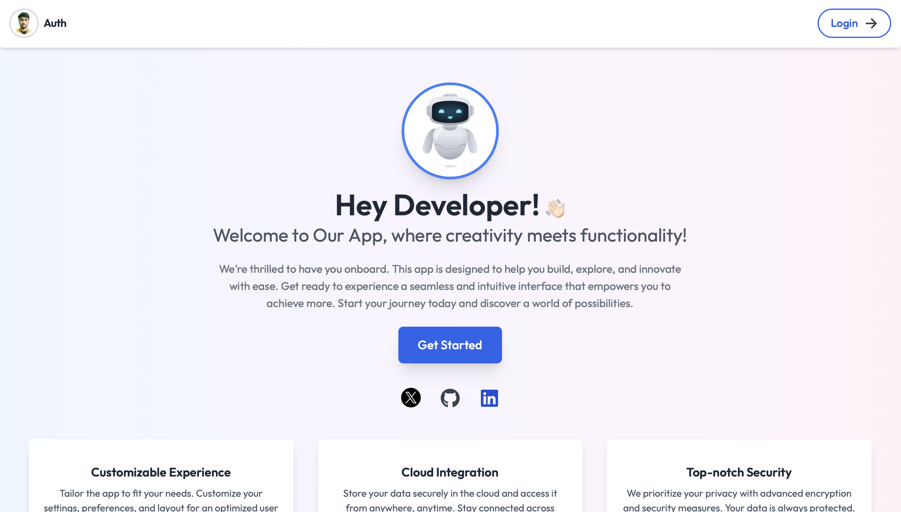

# Modern Authentication System 🔐

A comprehensive authentication system featuring a secure and user-friendly interface built with React, Node.js, MongoDB, and Tailwind CSS.



## 🏗️ Architecture Overview
Our system utilizes a modern cloud architecture deployed on AWS:

- **User interactions managed through GitHub**
- **Frontend built with React**
- **Node.js backend running on AWS EC2 instances**
- **Load balancing through AWS Elastic Load Balancer**
- **Multiple EC2 instances for high availability**
- **MongoDB database for secure data storage**

### Architecture Diagram


## 🌟 Features

### Elegant User Interface
Modern design with a seamless user experience across all authentication flows.

<div style="display: flex; justify-content: space-between; margin: 20px 0;">
  
  
</div>

### Complete Authentication Flow
- **User Registration** with email verification
- **Secure Login** system with JWT
- **Password Recovery** via email
- **Email Verification** with OTP
- **Profile Management**
- **Secure Logout**


### Key Features
- 🎨 **Customizable Experience**
  - Personalized user interface
  - Flexible settings and preferences
  - Optimized user experience

- ☁️ **Cloud Integration**
  - Secure MongoDB cloud storage
  - Reliable data access
  - Cross-platform compatibility

- 🔒 **Top-notch Security**
  - JWT-based authentication
  - Secure password hashing
  - Email verification system

## 🛠️ Technology Stack

### Backend
- Node.js
- Express.js
- MongoDB Atlas
- Libraries:
  - bcryptjs
  - cookie-parser
  - cors
  - dotenv
  - jsonwebtoken
  - nodemailer

### Frontend
- React with Vite
- Tailwind CSS
- Libraries:
  - axios
  - react-icons
  - react-router-dom
  - react-toastify
  - recoil

## 🚀 Getting Started

### Prerequisites
- Node.js installed
- MongoDB Atlas account
- Git

### Installation

1. **Clone the Repository**
```bash
git clone https://github.com/Debjyoti2004/Auth-app.git
cd Auth-app
```

2. **Backend Setup**
```bash
cd backend
npm install

# Create .env file with these configurations
MONGODB_URI=your-mongo-db-uri
JWT_SECRET=your-secret-key
NODE_ENV='development || production'
SMTP_USERNAME=your-userName
SMTP_PASSWORD=your-password
SENDER_EMAILID=your-email

# Start the server
npm run start
```

3. **Frontend Setup**
```bash
cd frontend
npm install

# Create .env file with this configuration
VITE_BACKEND_URL=Your Frontend URL

# Start the development server
npm run dev
```

## 📁 Project Structure

### Backend
```
backend/
├── controllers/
│   ├── authController.js
├── models/
│   ├── userModel.js
├── routes/
│   ├── authRoutes.js
├── utils/
│   ├── emailService.js
└── server.js
```

### Frontend
```
frontend/
├── src/
│   ├── components/
│   │   ├── AuthForm.js
│   │   ├── Navbar.js
│   ├── pages/
│   │   ├── SignIn.js
│   │   ├── SignUp.js
│   │   ├── ForgotPassword.js
│   ├── App.jsx
└── vite.config.js
```

## 🔒 Authentication Flow

1. **Registration**
   - User submits registration form
   - Email verification OTP sent
   - Account activated upon OTP verification

2. **Login**
   - Secure credential validation
   - JWT token generation
   - Session management

3. **Password Recovery**
   - Password reset request via email
   - Secure reset process
   - New password setup

4. **Session Management**
   - JWT token handling
   - Secure logout process

## 🚀 Deployment

### Backend Deployment
- Configure environment variables for production
- Update MongoDB connection string
- Set up email service credentials

### Frontend Deployment
- Update API endpoint for production
- Build the project: `npm run build`
- Deploy the `dist` folder

## 🤝 Contributing

1. Fork the repository
2. Create your feature branch:
```bash
git checkout -b feature/YourFeature
```
3. Commit your changes:
```bash
git commit -m 'Add YourFeature'
```
4. Push to the branch:
```bash
git push origin feature/YourFeature
```
5. Open a Pull Request

## 📝 License

This project is licensed under the MIT License.

## 📧 Contact

For queries and support:
- GitHub: [Debjyoti2004](https://github.com/Debjyoti2004)

---

Made with ❤️ by Debjyoti
